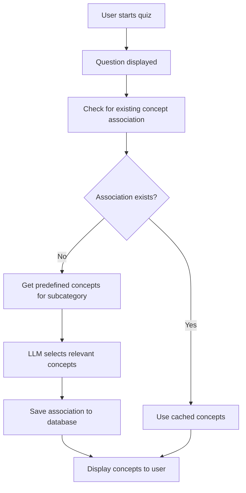
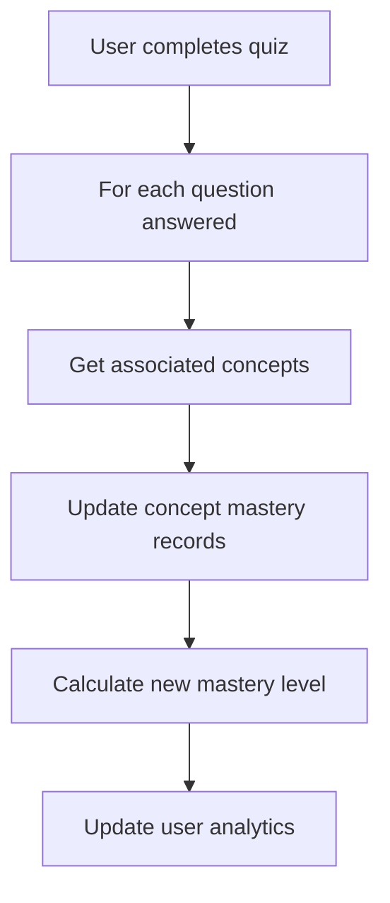

# Predefined Concepts System

## Overview

The Predefined Concepts System is a major enhancement to the quiz platform that replaces free-form concept generation with a standardized, analytics-driven approach. Instead of allowing the LLM to generate arbitrary concept names for each question, the system now uses predefined concepts that are carefully curated for each subcategory.

## Key Benefits

### 1. **Standardization**
- Eliminates duplicate concepts with slight naming variations
- Ensures consistent concept identification across questions
- Reduces the concept pool from 200-300 per subcategory to a manageable 15-25

### 2. **Enhanced Analytics**
- Track student performance by specific, standardized concepts
- Identify struggling concepts with precision
- Provide targeted recommendations based on concept mastery

### 3. **Personalized Learning**
- Alert students when consistently missing questions for specific concepts
- Generate personalized study plans based on concept weaknesses
- Track concept mastery progression over time

## System Architecture

### Database Collections

#### 1. `predefinedConcepts`
Stores the standardized concepts for each subcategory.

```javascript
{
  id: string,                    // Auto-generated Firestore ID
  subcategoryId: string,         // Subcategory (e.g., "linear-equations-one-variable")
  conceptId: string,             // Unique identifier (e.g., "solvingLinearEquations")
  name: string,                  // Display name (e.g., "Solving Linear Equations")
  description: string,           // Detailed explanation
  difficulty: number,            // 1-3 difficulty level
  source: string,                // "collegeboard", "admin", or "ai"
  active: boolean,               // Whether concept is currently active
  createdAt: timestamp,
  updatedAt: timestamp
}
```

#### 2. `questionConceptAssociations`
Maps questions to their associated predefined concepts (selected by LLM).

```javascript
{
  questionId: string,            // The question ID
  subcategoryId: string,         // The subcategory
  conceptIds: array,             // Array of conceptId strings selected by LLM
  selectedAt: timestamp,         // When LLM made the selection
  llmModel: string,              // LLM model used
  confidence: number,            // LLM confidence score (optional)
  reviewedBy: string,            // Manual review status
  lastUpdated: timestamp
}
```

#### 3. `users/{uid}/conceptMastery/{subcategoryId}_{conceptId}`
Tracks user's mastery of predefined concepts.

```javascript
{
  conceptId: string,             // The concept ID
  subcategoryId: string,         // The subcategory
  masteryLevel: number,          // 0-3 mastery level
  questionsAttempted: number,    // Questions attempted with this concept
  questionsCorrect: number,      // Questions answered correctly
  accuracy: number,              // Calculated accuracy percentage
  lastEncountered: timestamp,    // Last time user encountered this concept
  firstEncountered: timestamp,   // First encounter
  strugglingStreak: number,      // Consecutive incorrect answers
  masteredAt: timestamp          // When mastered (if applicable)
}
```

## Workflow

### 1. Concept Generation Flow


### 2. Mastery Tracking Flow


## Usage Guide

### Setting Up Concepts for a Subcategory

1. **Generate concept list using CollegeBoard questions:**
   ```bash
   # Use ChatGPT or similar to analyze 100 sample questions
   # Prompt: "Analyze these 100 [subcategory] questions and generate a comprehensive list of key concepts needed to solve them"
   ```

2. **Format as JSON:**
   ```json
   [
     {
       "conceptId": "solvingLinearEquations",
       "name": "Solving Linear Equations",
       "description": "Methods for isolating variables using algebraic operations"
     },
     {
       "conceptId": "distributiveProperty", 
       "name": "Distributive Property",
       "description": "The property that allows you to multiply a number by a sum by multiplying each addend separately"
     }
   ]
   ```
   
   **Note**: The subcategory association happens automatically during import - you don't include it in the JSON file. Each JSON file should contain concepts for ONE subcategory only.

3. **Import using the utility:**
   ```bash
   # Dry run first to test
   node scripts/importPredefinedConcepts.js import linear-equations-one-variable ./concepts/algebra.json --dry-run
   
   # Import for real
   node scripts/importPredefinedConcepts.js import linear-equations-one-variable ./concepts/algebra.json
   ```

### Managing Concepts

#### List existing concepts:
```bash
node scripts/importPredefinedConcepts.js list linear-equations-one-variable
```

#### Delete all concepts (use with caution):
```bash
node scripts/importPredefinedConcepts.js delete linear-equations-one-variable --confirm
```

#### Import additional concepts:
```bash
# Force overwrite existing concepts
node scripts/importPredefinedConcepts.js import linear-equations-one-variable ./concepts/additional.json --force
```

## API Changes

### Modified Helper Service

The `getConceptExplanations` function now:
1. Fetches predefined concepts for the subcategory
2. Asks LLM to select relevant concepts instead of generating new ones
3. Returns standardized concept objects with `conceptId` fields
4. Automatically saves question-concept associations

### New LLM Prompt Strategy

Instead of:
> "Generate 1-3 key concepts for this question"

We now use:
> "Select the most relevant concepts from this predefined list for this question"

This ensures consistency while maintaining the intelligence of concept selection.

## Analytics Features

### Concept Analytics Dashboard (`/concept-analytics`)
- **Struggling Concepts**: Shows concepts where user accuracy < 40%
- **Recommendations**: Personalized study suggestions
- **Study Plan**: Step-by-step improvement plan
- **Progress Tracking**: Mastery level progression

### Mastery Levels
- **0 - Not Attempted**: No questions attempted
- **1 - Struggling**: < 40% accuracy or 3+ consecutive wrong
- **2 - Understanding**: 40-79% accuracy
- **3 - Mastered**: ≥ 80% accuracy with ≥ 3 questions

## Implementation Timeline

### Phase 1: Infrastructure ✅
- [x] Database schema design
- [x] Firebase services for concept management
- [x] Updated helper service with predefined concept selection

### Phase 2: Data Import ✅
- [x] Import utility script
- [x] Sample concept files
- [x] Bulk import functionality

### Phase 3: Analytics ✅
- [x] Concept mastery tracking in quiz results
- [x] User analytics dashboard
- [x] Struggling concepts identification

### Phase 4: Content Population (In Progress)
- [ ] Generate concepts for all 29 subcategories
- [ ] Import concepts for all math subcategories (19 total)
- [ ] Import concepts for all reading/writing subcategories (10 total)

## Migration Strategy

The system is designed to be backward compatible:

1. **Fallback to Free-form**: If no predefined concepts exist for a subcategory, the system falls back to the original free-form generation
2. **Gradual Migration**: Subcategories can be migrated one at a time
3. **No Data Loss**: Existing user progress and quiz data remain unaffected

## Next Steps

1. **Complete Content Population**: Create concept lists for all 29 subcategories
2. **Enhanced Analytics**: Add concept mastery trends and predictions
3. **Adaptive Questioning**: Use concept mastery data to influence question selection
4. **Teacher Dashboard**: Allow educators to view student concept mastery across classes

## File Structure

```
src/
├── firebase/
│   ├── predefinedConceptsSchema.js     # Database schema definitions
│   └── predefinedConceptsServices.js   # CRUD operations
├── pages/
│   └── ConceptAnalytics.jsx            # Analytics dashboard
├── styles/
│   └── ConceptAnalytics.css            # Dashboard styles
└── utils/
    └── smartQuizUtils.js               # Updated with concept tracking

api/
└── helperService.js                    # Modified for predefined concepts

scripts/
└── importPredefinedConcepts.js         # Import utility

concepts/
└── sample-linear-equations-concepts.json # Example concept file

docs/
└── PREDEFINED_CONCEPTS_SYSTEM.md       # This documentation
```

## Troubleshooting

### Common Issues

1. **"No predefined concepts found"**: Ensure concepts are imported for the subcategory
2. **Import fails**: Check JSON format and required fields
3. **Analytics not showing**: Verify concept associations exist for questions

### Debugging

Enable detailed logging:
```javascript
// In browser console
localStorage.setItem('debug', 'predefined-concepts');
```

### Support

For technical issues or questions about the predefined concepts system, contact the development team or create an issue in the project repository. 