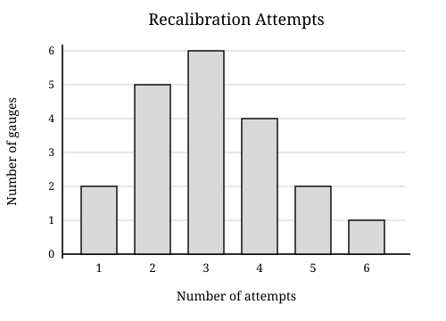
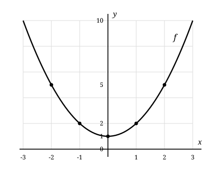
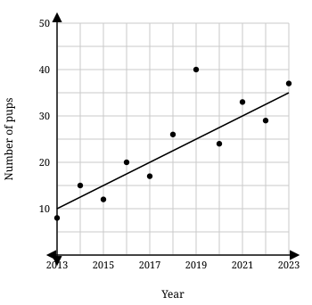

# SAT Practice Test 10 — Math Module 1

22 questions · 35 minutes · calculator allowed

For student-produced response questions, enter a single numeric answer. Figures are drawn to scale unless otherwise indicated.

---
### 1

_easy · linear-equations-two-variables_

The x-coordinate of each point on a line is 17 less than 4 times its y-coordinate. Which equation represents the line?

A. x = 4y - 17

B. x = 4y + 17

C. y = 4x - 17

D. y = 4x + 17

---

### 2

_easy · equivalent-expressions_

2x(x + 5) - x(x - 1)

Which expression is equivalent to the given expression?

A. x² + 9x

B. x² + 10x

C. x² + 11x

D. 3x² + 9x

---

### 3

_easy · one-variable-data_

A technician recorded the number of recalibration attempts required for each of 20 pressure gauges. The results are shown.

What is the range of the numbers of recalibration attempts?

A. 1

B. 5

C. 6

D. 20

---

### 4

_easy · linear-equations-one-variable_

7(x - 2) = 3x + 18

What is the solution to the given equation?

A. 2

B. 4

C. 6

D. 8

---

### 5

_easy · area-volume_

A triangular acoustic panel has a base of 22 inches and a perpendicular height of 8 inches. What is the area, in square inches, of the panel?

_Student-produced response_

---

### 6

_easy · linear-equations-one-variable_

(3/5)x + 7 = 19

If x satisfies the given equation, what is the value of 3x?

_Student-produced response_

---

### 7

_easy · nonlinear-functions_

The graph of the function f is shown.

Which equation could define f?

A. f(x) = x² - 1

B. f(x) = x² + 1

C. f(x) = -x² + 1

D. f(x) = (x - 1)²

---

### 8

_easy · systems-linear-equations_

x + 2y = 7

3x - y = 7

Which ordered pair (x, y) is the solution to the given system of equations?

A. (3, 2)

B. (2, 3)

C. (1, 3)

D. (2, -1)

---

### 9

_easy · ratios-rates-proportions_

A laser cutter completes 7 identical paths in 12.6 minutes at a constant rate. At this rate, how many minutes will it take the cutter to complete 15 paths?

A. 1.8

B. 12.6

C. 25.2

D. 27

---

### 10

_medium · nonlinear-equations_

|3x - 5| = x + 7

Which pair lists all solutions to the given equation?

A. (-1/2, 11/2)

B. (-3, 6)

C. (-1/2, 6)

D. (1/2, 6)

---

### 11

_medium · inference-statistics_

A utility will estimate the proportion of its 18,000 streetlights that need a lens replacement. Plan A uses a simple random sample of 250 streetlights, and plan B uses a simple random sample of 1,000 streetlights. Which statement is most likely true?

A. The estimate from plan B will have a smaller margin of error than the estimate from plan A.

B. The estimate from plan A will have a smaller margin of error because fewer streetlights are inspected.

C. The two estimates will have the same margin of error because they are taken from the same population.

D. The estimate from plan B will equal the exact population proportion because its sample is larger.

---

### 12

_medium · equivalent-expressions_

(2x^2 + kx + 15)/(2x + 5) = x + 3

The given equation is true for all x ≠ -5/2, where k is a constant. What is the value of k?

_Student-produced response_

---

### 13

_medium · two-variable-data_

The scatterplot shows measurements from eight fan settings and a line of best fit.

What is the slope of the line of best fit shown?

_Student-produced response_

---

### 14

_medium · linear-equations-two-variables_

(k + 2)x - 3y = 18

The line defined by the given equation passes through the point (3, -1). What is the value of k?

A. -3

B. -1

C. 1

D. 3

---

### 15

_medium · lines-angles-triangles_

In the figure, the angle labeled (7x - 5)° is an exterior angle of the triangle.

What is the measure, in degrees, of the exterior angle?

A. 10

B. 60

C. 65

D. 115

---

### 16

_medium · nonlinear-functions_

The graph of a function f contains the point (2, -5). The function g is defined by g(x) = f(x - 4) + 3.

Which point must lie on the graph of g?

A. (-2, -2)

B. (6, -2)

C. (-2, -8)

D. (6, -8)

---

### 17

_hard · circles_

x^2 + y^2 - 8x + 6y = 0

The graph of the given equation is a circle. A line tangent to the circle at (8, 0) crosses the y-axis at (0, b). What is the value of b?

A. -4/3

B. 3/4

C. 8

D. 32/3

---

### 18

_hard · linear-functions_

During a test, the temperature T(t), in degrees Celsius, of a thermal chamber changes linearly with time t. For a constant k, T(2) = 3k + 7, T(8) = k - 5, and T(14) = -2k + 13.

What is the value of T(5)?

A. 97

B. 61

C. 30

D. -12

---

### 19

_hard · systems-linear-equations_

3x + 2y = 8

5x - 2y = 6

The solution to the given system is (x, y). What is the value of y - x?

_Student-produced response_

---

### 20

_hard · one-variable-data_

Data set A has mean 14 and standard deviation s. Data set B is formed by replacing every value a in data set A with 3a - 2.

Which statement correctly gives the mean and standard deviation of data set B?

A. The mean is 40, and the standard deviation is 3s.

B. The mean is 40, and the standard deviation is 3s - 2.

C. The mean is 42, and the standard deviation is 3s.

D. The mean is 42, and the standard deviation is 3s - 2.

---

### 21

_hard · nonlinear-functions_

The function f is quadratic and f(2) = f(14).

I. The axis of symmetry of the graph of f is x = 8.
II. f(5) = f(11).

Which of the statements must be true?

A. I only

B. II only

C. I and II

D. Neither I nor II

---

### 22

_hard · nonlinear-equations_

√(x + 18) = x + a

In the given equation, a is a positive integer. If the equation has exactly one real solution, what is the greatest possible value of a?

_Student-produced response_

---
