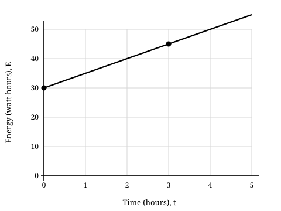
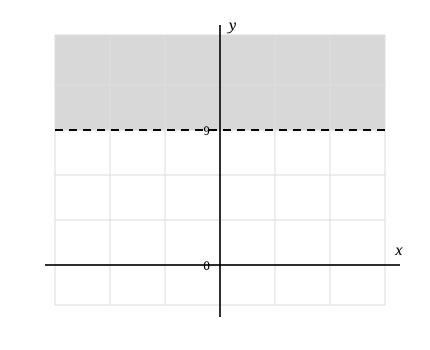
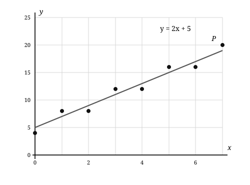

# SAT Practice Test 10 — Math Module 2

22 questions · 35 minutes · calculator allowed

For student-produced response questions, enter a single numeric answer. Figures are drawn to scale unless otherwise indicated.

---
### 1

_easy · ratios-rates-proportions_

A weather station records a wind speed of 2.4 meters per second. What is this speed, in centimeters per minute? (1 meter = 100 centimeters and 1 minute = 60 seconds)

A. 240

B. 14,400

C. 144,000

D. 864,000

---

### 2

_easy · area-volume_

A rectangular electronic display is 12 feet wide and 8 feet high. It is assembled without gaps from square display panels that each have a side length of 2 feet. How many panels are used?

A. 6

B. 10

C. 20

D. 24

---

### 3

_easy · nonlinear-functions_

f(x) = 3 + √(x + 7)

What is the value of f(9)?

A. 7

B. 12

C. 16

D. 19

---

### 4

_easy · equivalent-expressions_

(18x^7y^3)/(6x^2y)

Which expression is equivalent to the given expression?

A. 3x⁵y³

B. 12x⁵y²

C. 3x⁵y²

D. 3x⁹y⁴

---

### 5

_easy · systems-linear-equations_

2x + y = 17

2x - y = 7

The solution to the given system is (x, y). What is the value of y?

_Student-produced response_

---

### 6

_easy · percentages_

An additive makes up 15% of the mass of a 250-gram material sample. What is the mass, in grams, of the additive?

_Student-produced response_

---

### 7

_easy · linear-functions_

The graph shows the energy E, in watt-hours, stored in a backup battery t hours after charging begins.

How many watt-hours of energy were stored in the battery when charging began?

A. 0

B. 5

C. 15

D. 30

---

### 8

_easy · nonlinear-functions_

The table shows values of a quadratic function f.
<table style="border-collapse:collapse; margin:10px auto; text-align:center;"><caption style="padding:4px; font-weight:bold;">Values of f</caption><tr><th scope="row" style="border:1px solid #000; padding:6px 11px;">x</th><th scope="col" style="border:1px solid #000; padding:6px 11px;">-1</th><th scope="col" style="border:1px solid #000; padding:6px 11px;">0</th><th scope="col" style="border:1px solid #000; padding:6px 11px;">1</th><th scope="col" style="border:1px solid #000; padding:6px 11px;">2</th><th scope="col" style="border:1px solid #000; padding:6px 11px;">3</th></tr><tr><th scope="row" style="border:1px solid #000; padding:6px 11px;">f(x)</th><td style="border:1px solid #000; padding:6px 11px;">8</td><td style="border:1px solid #000; padding:6px 11px;">3</td><td style="border:1px solid #000; padding:6px 11px;">0</td><td style="border:1px solid #000; padding:6px 11px;">-1</td><td style="border:1px solid #000; padding:6px 11px;">0</td></tr></table>

At which value of x shown in the table does f(x) have its minimum value?

A. 1

B. 2

C. 3

D. 4

---

### 9

_easy · linear-inequalities_

An equipment rack can support at most 680 pounds. Equipment already on the rack has a total mass of 125 pounds, and each additional unit has a mass of 37 pounds. If n additional units are placed on the rack, which inequality represents this situation?

A. 37 + 125n ≤ 680

B. 125 + 37n ≥ 680

C. 125 + 37n ≤ 680

D. 37n ≤ 680

---

### 10

_medium · nonlinear-functions_

The intensity of a signal d meters from a transmitter is modeled by S(d) = 320(0.90)^d/5.

According to the model, for each 10-meter increase in d, the signal intensity decreases by what percent?

A. 81%

B. 20%

C. 19%

D. 10%

---

### 11

_medium · linear-inequalities_

ky > 171
The solution set of the given inequality is graphed in the xy-plane, where k is a positive constant.

What is the value of k?

A. 9

B. 19

C. 171

D. 180

---

### 12

_medium · nonlinear-equations_

2x^2 - 3x - 14 = 0

What is the positive solution to the given equation?

_Student-produced response_

---

### 13

_medium · linear-equations-two-variables_

In the xy-plane, a line has slope -3/2 and passes through the point (4, 9). What is the x-coordinate of the x-intercept of the line?

_Student-produced response_

---

### 14

_medium · right-triangles-trigonometry_

Triangle ABC is a right triangle. The side lengths shown are in centimeters.

What is the value of cos A?

A. 40/41

B. 9/40

C. 9/41

D. 1/41

---

### 15

_medium · probability_

A container holds 18 brass tokens and 12 steel tokens. Steel tokens are added, and no tokens are removed. How many steel tokens must be added so that the probability of selecting a brass token at random is 1/3?

A. 6

B. 12

C. 18

D. 24

---

### 16

_medium · linear-functions_

The volume V, in milliliters, of solution in an ultrasonic cleaner changes linearly with time t, in minutes. At t = 6, the volume is 74 milliliters, and at t = 14, the volume is 46 milliliters.

Which equation gives V in terms of t?

A. V = 95 + 3.5t

B. V = 74 - 3.5t

C. V = 95 - 3.5t

D. V = 74 - 28t

---

### 17

_hard · circles_

Circle A has equation (x - 2)^2 + (y + 1)^2 = 25. Circle B has center (9, -1) and is externally tangent to circle A.

Which equation represents circle B?

A. (x - 9)² + (y + 1)² = 2

B. (x - 9)² + (y + 1)² = 4

C. (x + 9)² + (y - 1)² = 4

D. (x - 9)² + (y + 1)² = 25

---

### 18

_hard · linear-equations-one-variable_

a(2x - 3) + 4 = 10x + b

In the given equation, a and b are constants. If the equation is true for all values of x, what is the value of a + b?

A. -6

B. 5

C. 11

D. 16

---

### 19

_hard · nonlinear-equations_

4^x - 5(2^x) + 4 = 0

What is the sum of all real solutions to the given equation?

_Student-produced response_

---

### 20

_hard · two-variable-data_

A scatterplot and its line of best fit, y = 2x + 5, are shown. Point P = (7, 20) is one of the data points. For a data point, the residual is the observed y-value minus the y-value predicted by the line of best fit.

Point Q has x-coordinate 7 and a residual equal to -2 times the residual of point P. What are the coordinates of point Q?

A. (7, 17)

B. (7, 18)

C. (7, 19)

D. (7, 21)

---

### 21

_hard · lines-angles-triangles_

For triangles ABC and DEF, AB/DE = BC/EF.

Which additional statement is sufficient to prove that triangle ABC is similar to triangle DEF?

A. Angle A is congruent to angle D.

B. AC = DF.

C. Angle C is congruent to angle F.

D. Angle B is congruent to angle E.

---

### 22

_hard · nonlinear-functions_

The quadratic function f has zeros -1 and 7, and f(2) = 30. What is the maximum value of f?

_Student-produced response_

---
